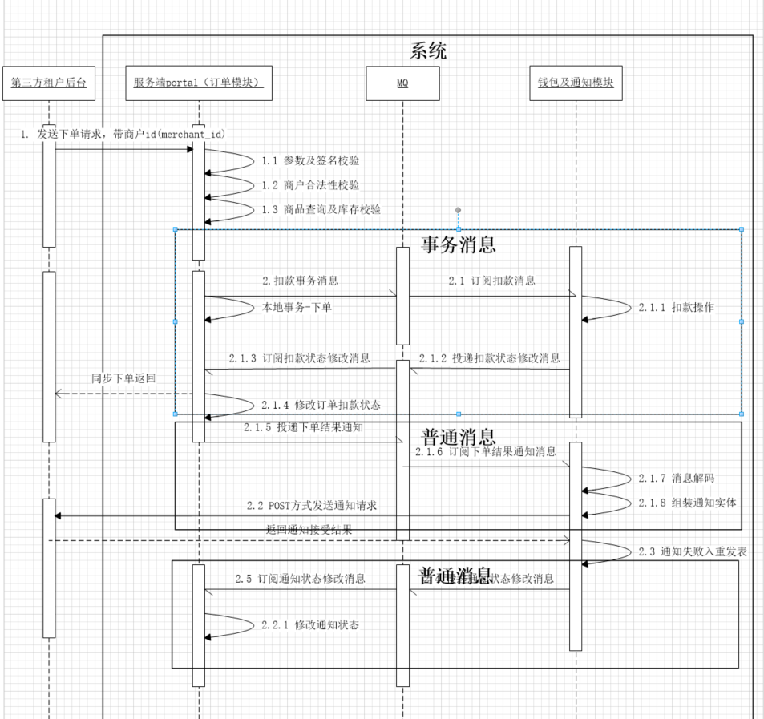

# Readme

> 场景为：示例项目以客户端模拟下单成功，下单成功后服务端回调客户端修改订单状态场景进行讲解。
即：模拟下单并处理异步通知

## 主要技术

    消息队列（RocketMQ）: 作用，长流程异步化，提升吞吐量，削峰填谷
        |-普通消息的发布及订阅
        |-事务消息的发布及订阅
    线程池 
        |-事务消息回查
    SpringBoot
        |-配置资源预加载
    RestTemplate
        |-application/json格式数据的发送
        |-application/x-www-form-urlencoded格式数据的发送

## 思路

业务流程图如下

## 业务描述
1. 用户访问第三方售票网关，进行购票操作。用户发起下单操作，执行支付转账操作

        扣减用户账户，增加商户账户金额

2. 转账完成之后，商户发起下单操作，售票平台进行下单操作及扣款操作，（此处为讲解重点-- **事务消息，分布式事务场景**）返回订单提交成功
3. 售票平台下单扣款完成后，认为售票成功，则返回结果通知给第三方售票网关（此处为讲解重点-- **普通消息，异步通知**）
4. 第三方售票网关自行给用户通知即可，未实现

> 注意：商品信息直接在初始化的时候记载到第三方售票网关和售票平台的缓存中即可。

## 说明

下单与扣款通过事务消息保证一致性，保证成功率

通知过程通过MQ进行异步解耦，使用普通消息即可，因为通知过程本身是为了最大努力送达，属于最终一致性的范畴，不要求数据的强一致性。

如果通知达到上限阈值，则停止通知，等待商户侧发起主动查询即可。通过通知回调+主动查询，能够在跨网络的交易场景下，实现端与端之间的订单状态的最终一致。

在平台内部，跨服务之间的分布式事务，通过RMQ的事务消息得到保证，事务消息原理可简单介绍。

